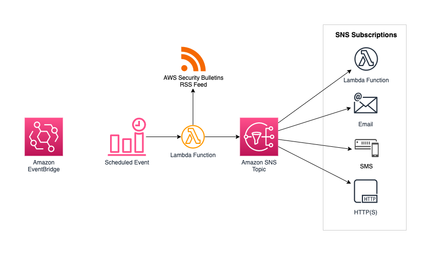

# AWS Automatic Security Bulletin Alerts

This CDK project deploys an AWS Lambda Function which is scheduled for every full hour.
It checks the RSS feed of [this page](https://aws.amazon.com/security/security-bulletins) for new AWS Security Bulletins and publishes new alerts to an [Amazon SNS](https://aws.amazon.com/sns/) topic.
Various types of [subscribers](https://docs.aws.amazon.com/sns/latest/dg/sns-event-destinations.html) can be added to this topic, for example E-Mail or SMS recipients.

## Architecture

## Configuration
In `lib/cve-alert-stack.ts` you can
* Configure various subscribers for the SNS topic. See examples beginning in [Line 15](lib/cve-alert-stack.ts#L15)
* Configure the Event Schedule to trigger the lambda. Default every full hour. See [Line 50](lib/cve-alert-stack.ts#L50) and check out [the documentation](https://docs.aws.amazon.com/cdk/api/v1/docs/@aws-cdk_aws-events.CronOptions.html)

## Cost considerations
tbd.

## Deployment
If your AWS account is not yet bootstrapped, run

    $ cdk bootstrap

To deploy the project, run

    $ cdk deploy

